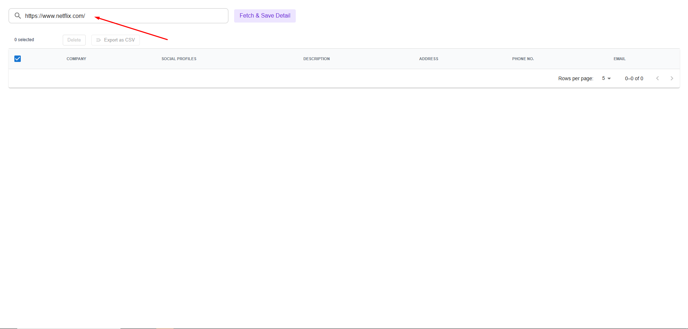
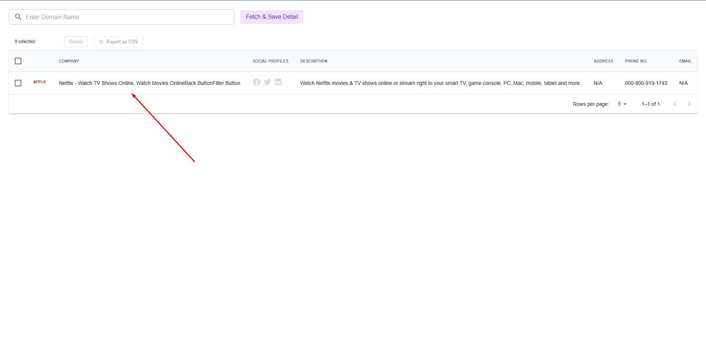
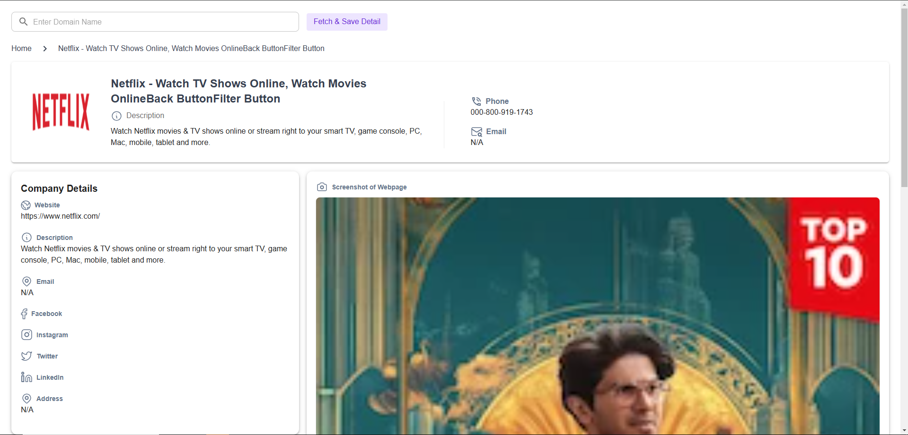

# netflix_scraping

## Available Scripts

In the project directory, you can run:

**Note: this command for Both Frontend and Backend File!**
### `npm run start`

Runs the app in the development mode.\
Open [http://localhost:3000](http://localhost:3000) to view it in your browser.
[http://localhost:8000](http://localhost:8000) for backend code.

The page will reload when you make changes.\
You may also see any lint errors in the console.

**Note: this command for Front End File!**
### `npm test`

Launches the test runner in the interactive watch mode.\
See the section about [running tests](https://facebook.github.io/create-react-app/docs/running-tests) for more information.

### `npm run build`

Builds the app for production to the `build` folder.\
It correctly bundles React in production mode and optimizes the build for the best performance.

The build is minified and the filenames include the hashes.\
Your app is ready to be deployed!

See the section about [deployment](https://facebook.github.io/create-react-app/docs/deployment) for more information.

**How It Works!**
1. Run both the frontend and backend code.
2. Open http://localhost:3000 in your browser.
3. Enter the URL of the website you want to scrape data from in the highlighted input box like below Image and then click on Feth & save Detail button.

4. After some time your website details shown in below table like below Image

5. when you click on that company tab you will see that company information in detail like below Image
